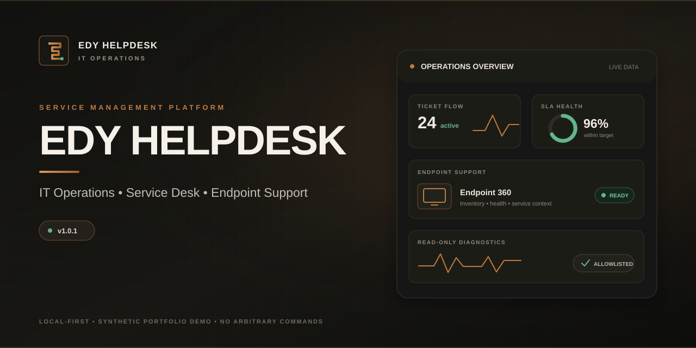
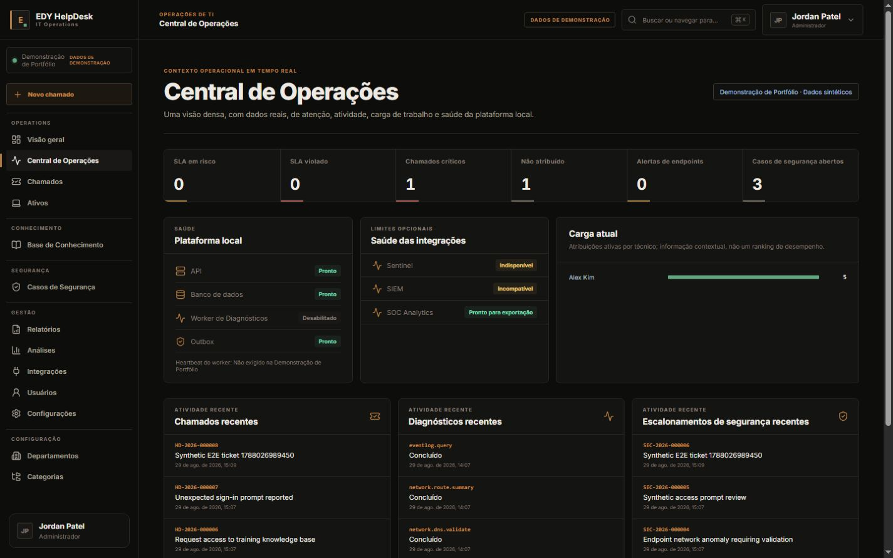
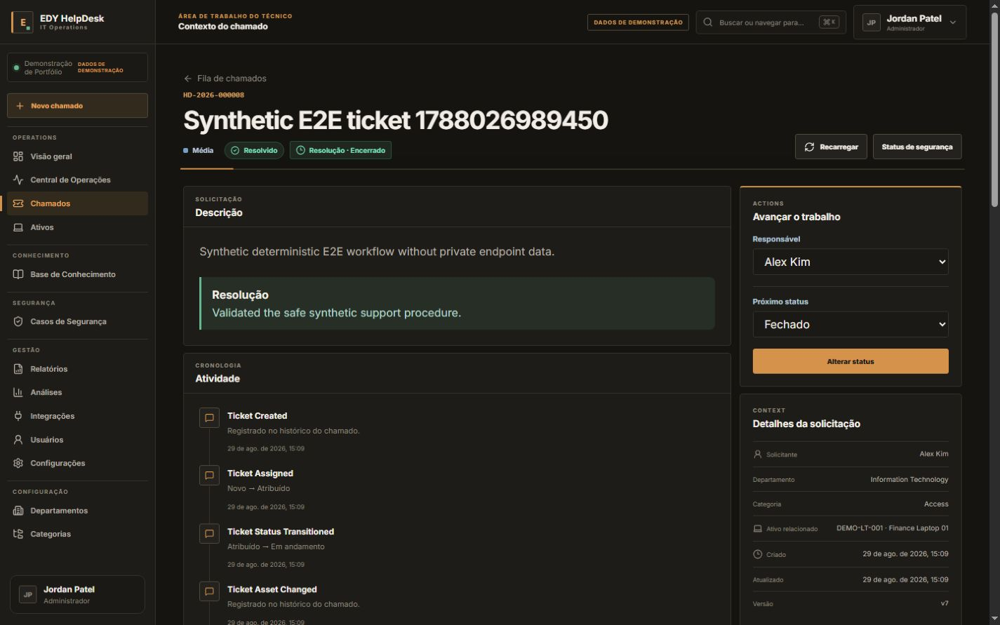
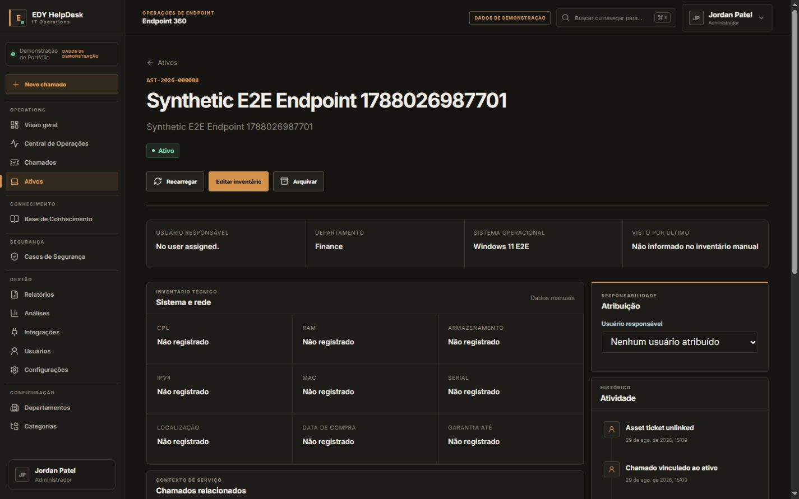
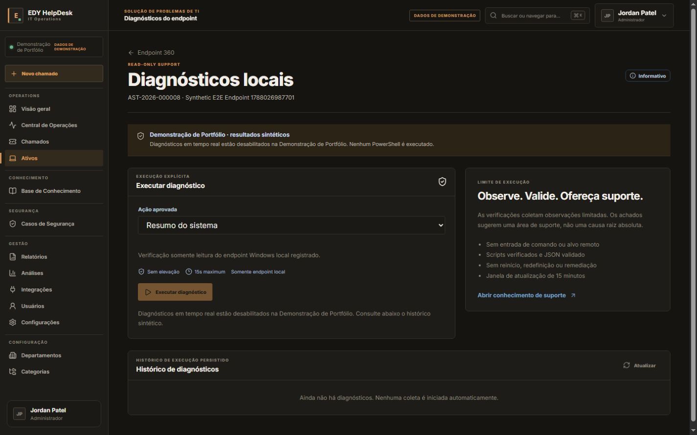
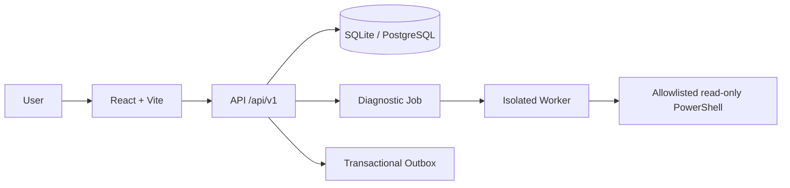

<p align="center">
  <a href="README.md">Português</a> · <a href="README.en.md">English</a>
</p>



# EDY HelpDesk

A local-first Service Desk for ticket, SLA, asset, and Windows endpoint support. The project combines practical IT Operations workflows with read-only diagnostics, security-first boundaries, and a fully synthetic portfolio demo.

<p>
  
  <a href="LICENSE"></a>
  
  
  
  
</p>

## Video presentation

https://github.com/user-attachments/assets/9ccf35d5-9703-4008-8dfe-d918862362b8

## Highlights

- 🎫 **Service Desk & Ticket Workflow** — governed lifecycle, assignment, timeline, and optimistic locking.
- ⏱️ **SLA Management** — pause, resume, at-risk, and breach calculations over persisted data.
- 💻 **Assets & Endpoint 360** — inventory, ownership, history, and support context.
- 🩺 **Windows Diagnostics** — read-only allowlisted catalog, isolated Worker, and no arbitrary commands.
- 📚 **Knowledge Base** — versioned articles, drafts, publishing, and ticket references.
- 🛡️ **Security Escalation** — Ticket → Security Case, sanitized evidence, and append-only history.
- 📊 **Operations & Reports** — dashboards, metrics, and minimized exports from application data.
- 🌎 **pt-BR / English** — Operations and Dark themes with persistent preferences.

## Screenshots

Every screen below uses **Portfolio Demo** and synthetic data.

| Operations Center | Ticket Workspace |
|---|---|
|  |  |
| Endpoint 360 | Diagnostics |
|  |  |

[View all screenshots →](docs/screenshots/release-1.0.0/)

## Quick Start

### Option A — Quick Demo on Windows

1. Download the [current main-branch source](https://github.com/EDY075/EDY-HelpDesk/archive/refs/heads/main.zip) and extract it.
2. Run `setup-demo.bat` once.
3. Keep the locally generated demo password shown when setup completes.
4. Run `start-demo.bat`; your browser opens `http://127.0.0.1:5173`.
5. Run `stop-demo.bat` when finished.

Synthetic accounts:

```text
demo.admin
demo.technician
demo.viewer
```

The password is never stored on GitHub. It is created on your computer and kept only in the Git-ignored `.env` file.

### Option B — Manual Setup

```powershell
git clone https://github.com/EDY075/EDY-HelpDesk.git
cd EDY-HelpDesk
npm ci
copy .env.example .env
```

Set a local `DEMO_SEED_PASSWORD` with at least 12 characters in `.env`, then run:

```powershell
npm run db:generate
npm run db:migrate
npm run db:seed
npm run dev
```

Requirements: Windows, Linux, or macOS; Node.js `>=22.12.0`; npm `>=10`. See the [technical setup guide](docs/GETTING-STARTED.md) for advanced configuration.

## Download & Try

- [GitHub Release v1.0.1](https://github.com/EDY075/EDY-HelpDesk/releases/tag/v1.0.1)
- [Source code — main](https://github.com/EDY075/EDY-HelpDesk)

The official source archive from `main` or release `v1.0.1`, together with the public launchers, provides the Download → Setup → Start → Browser flow. No duplicate ZIP, executable, or preloaded database is required.

## Architecture



Web, API, and Diagnostics Worker run as separate processes. The application is a modular monolith with versioned contracts, a transactional outbox, and an SQLite → PostgreSQL strategy. [Full architecture →](ARCHITECTURE.md)

## Security by Design

- Isolated Diagnostics Worker and server-owned PowerShell catalog.
- `requiresElevation=false`; no arbitrary shell, remediation, or remote target.
- Deny-by-default RBAC, server-side sessions, and origin/CSRF controls.
- Append-only audit trail and optimistic locking for concurrent mutations.
- Portfolio Demo blocks real diagnostics and external integrations.
- API and Vite bind to localhost by default; public errors are sanitized.

[Controls, threat model, and disclosure →](SECURITY.md)

## Tech Stack

| Layer | Technologies |
|---|---|
| Web | React, TypeScript, Vite, React Router, TanStack Query |
| API | Node.js, Express, Prisma, Zod, Pino |
| Data | Local SQLite, PostgreSQL projection, versioned migrations |
| Quality | Vitest, Supertest, Playwright, ESLint |

## Languages & Themes

- **Languages:** Português do Brasil (`pt-BR`) and English (`en`).
- **Operations:** graphite/charcoal identity with an amber/copper accent.
- **Dark:** darker minimal alternative without a cyber/neon aesthetic.

Language and theme are available on Login, the account menu, and **Settings → Appearance**, and persist after reload.

## Testing

- **249/249** unit and integration tests.
- **51/51** Playwright E2E scenarios.
- **434/434** approved responsive-matrix checks.
- Lint, typecheck, build, dependency audit, secret scan, and database integrity passed for `v1.0.1`.

```bash
npm run check
npm run e2e
npm run audit:dependencies
npm run scan:secrets
```

## Documentation

- [Documentation index](docs/README.md)
- [Architecture](ARCHITECTURE.md) · [Security](SECURITY.md) · [Roadmap](ROADMAP.md)
- [API documentation](docs/api/) · [Release notes](docs/RELEASE-NOTES-1.0.1.md)
- [Production readiness](docs/operations/PRODUCTION-READINESS-BASELINE.md)
- [Publication and security reports](docs/PUBLICATION-GATE-REPORT.md)

## Known Limitations

- Public Internet deployment, real TLS/proxy, and a production secret manager have not been validated.
- PostgreSQL parity is statically verified; a live-server cutover remains pending.
- External EDY integrations are optional, disabled by default, and fail-closed.

[Production Readiness Baseline →](docs/operations/PRODUCTION-READINESS-BASELINE.md)

## License

Licensed under the [MIT License](LICENSE). Copyright (c) 2026 Edmilson Gomes.

## Author / Portfolio

An IT Operations engineering and portfolio project published by [GitHub @EDY075](https://github.com/EDY075).
