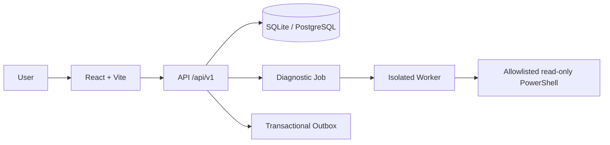

<p align="center">
  <a href="README.md">Português</a> · <a href="README.en.md">English</a>
</p>


# EDY HelpDesk

Service Desk local-first para gestão de chamados, SLA, ativos e suporte a endpoints Windows. O projeto combina fluxos reais de IT Operations com diagnósticos read-only, segurança por padrão e uma demonstração de portfólio exclusivamente sintética.

<p>
  
  <a href="LICENSE"></a>
  
  
  
  
</p>

## Apresentação em vídeo

https://github.com/user-attachments/assets/9ccf35d5-9703-4008-8dfe-d918862362b8

## Highlights

- 🎫 **Service Desk & Ticket Workflow** — lifecycle governado, assignment, timeline e optimistic locking.
- ⏱️ **SLA Management** — pausa, retomada, risco e breach calculados sobre dados persistidos.
- 💻 **Assets & Endpoint 360** — inventário, ownership, histórico e contexto de atendimento.
- 🩺 **Windows Diagnostics** — catálogo read-only allowlisted, Worker isolado e zero comandos arbitrários.
- 📚 **Knowledge Base** — artigos versionados, drafts, publicação e vínculo com chamados.
- 🛡️ **Security Escalation** — Ticket → Security Case, evidências sanitizadas e trilha append-only.
- 📊 **Operations & Reports** — dashboards, métricas e exports minimizados com dados reais da aplicação.
- 🌎 **pt-BR / English** — temas Operations e Dark com preferências persistentes.

## Screenshots

Todas as telas abaixo usam **Portfolio Demo** e dados sintéticos.

| Operations Center | Ticket Workspace |
|---|---|
|  |  |
| Endpoint 360 | Diagnostics |
|  |  |

[Ver todos os screenshots →](docs/screenshots/release-1.0.0/)

## Quick Start

### Opção A — Demo rápida no Windows

1. Baixe o [source code atual da branch main](https://github.com/EDY075/EDY-HelpDesk/archive/refs/heads/main.zip) e extraia a pasta.
2. Execute `setup-demo.bat` uma vez.
3. Guarde a senha demo gerada localmente e exibida ao final do setup.
4. Execute `start-demo.bat`; o navegador abrirá `http://127.0.0.1:5173`.
5. Ao terminar, execute `stop-demo.bat`.

Contas sintéticas disponíveis:

```text
demo.admin
demo.technician
demo.viewer
```

A senha não fica no GitHub: ela é criada no seu computador e armazenada somente no `.env` ignorado pelo Git.

### Opção B — Setup manual

```powershell
git clone https://github.com/EDY075/EDY-HelpDesk.git
cd EDY-HelpDesk
npm ci
copy .env.example .env
```

Defina no `.env` uma `DEMO_SEED_PASSWORD` local com pelo menos 12 caracteres. Depois:

```powershell
npm run db:generate
npm run db:migrate
npm run db:seed
npm run dev
```

Requisitos: Windows, Linux ou macOS; Node.js `>=22.12.0`; npm `>=10`. Veja o [guia técnico de instalação](docs/GETTING-STARTED.md) para configuração avançada.

## Download & Try

- [GitHub Release v1.0.1](https://github.com/EDY075/EDY-HelpDesk/releases/tag/v1.0.1)
- [Source code — main](https://github.com/EDY075/EDY-HelpDesk)

O source archive oficial da branch `main` ou da release `v1.0.1` mais os launchers públicos cobre o fluxo Download → Setup → Start → Browser. Nenhum ZIP duplicado, executável ou banco pré-carregado é necessário.

## Architecture



Web, API e Diagnostics Worker são processos separados. A aplicação é um modular monolith com contratos versionados, outbox transacional e estratégia SQLite → PostgreSQL. [Arquitetura completa →](ARCHITECTURE.md)

## Security by Design

- Diagnostics Worker isolado e PowerShell restrito ao catálogo server-owned.
- `requiresElevation=false`, sem shell arbitrário, remediação ou alvo remoto.
- RBAC deny-by-default, sessões server-side e proteção de origem/CSRF.
- Audit trail append-only e optimistic locking nas mutações concorrentes.
- Portfolio Demo bloqueia diagnósticos reais e integrações externas.
- API e Vite escutam em localhost por padrão; erros públicos são sanitizados.

[Controles, threat model e disclosure →](SECURITY.md)

## Tech Stack

| Camada | Tecnologias |
|---|---|
| Web | React, TypeScript, Vite, React Router, TanStack Query |
| API | Node.js, Express, Prisma, Zod, Pino |
| Data | SQLite local, projeção PostgreSQL, migrations versionadas |
| Quality | Vitest, Supertest, Playwright, ESLint |

## Languages & Themes

- **Languages:** Português do Brasil (`pt-BR`) e English (`en`).
- **Operations:** identidade graphite/charcoal com acento amber/copper.
- **Dark:** alternativa mais escura e minimalista, sem estética cyber/neon.

Idioma e tema podem ser alterados no login, menu da conta ou em **Configurações → Aparência** e persistem após reload.

## Testing

- **249/249** testes unitários e de integração.
- **51/51** cenários E2E Playwright.
- **434/434** checks da matriz responsiva aprovada.
- Lint, typecheck, build, dependency audit, secret scan e database integrity aprovados na release `v1.0.1`.

```bash
npm run check
npm run e2e
npm run audit:dependencies
npm run scan:secrets
```

## Documentation

- [Documentation index](docs/README.md)
- [Architecture](ARCHITECTURE.md) · [Security](SECURITY.md) · [Roadmap](ROADMAP.md)
- [API documentation](docs/api/) · [Release notes](docs/RELEASE-NOTES-1.0.1.md)
- [Production readiness](docs/operations/PRODUCTION-READINESS-BASELINE.md)
- [Publication and security reports](docs/PUBLICATION-GATE-REPORT.md)

## Known Limitations

- Deploy público em Internet, TLS/proxy real e secret manager não foram validados.
- A paridade PostgreSQL é verificada estaticamente; o cutover em servidor ao vivo permanece pendente.
- Integrações EDY externas são opcionais, desabilitadas por padrão e fail-closed.

[Production Readiness Baseline →](docs/operations/PRODUCTION-READINESS-BASELINE.md)

## License

Licenciado sob a [MIT License](LICENSE). Copyright (c) 2026 Edmilson Gomes.

## Author / Portfolio

Projeto de engenharia e portfólio de IT Operations publicado por [GitHub @EDY075](https://github.com/EDY075).
