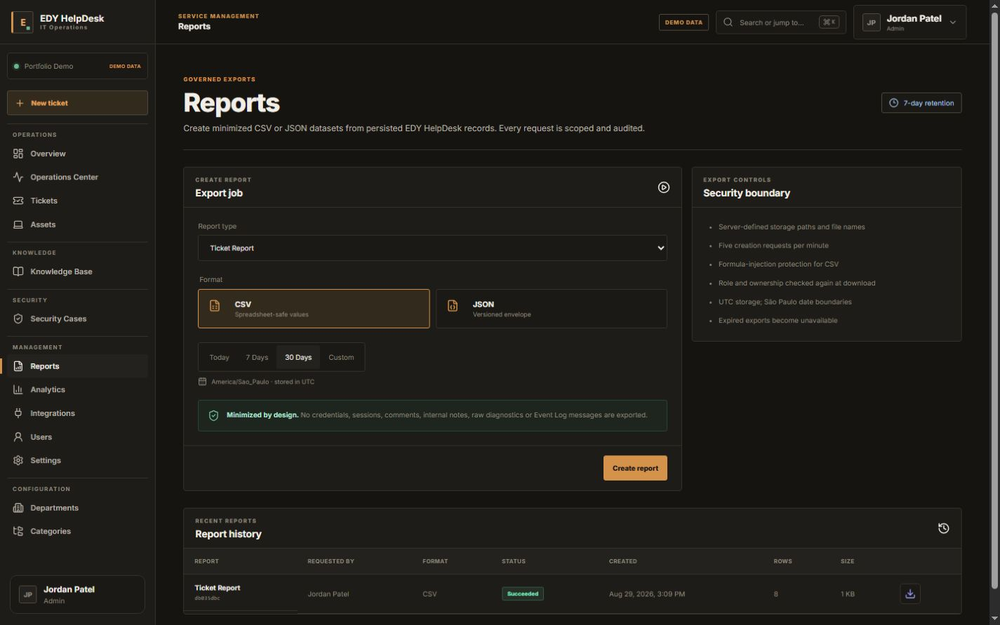
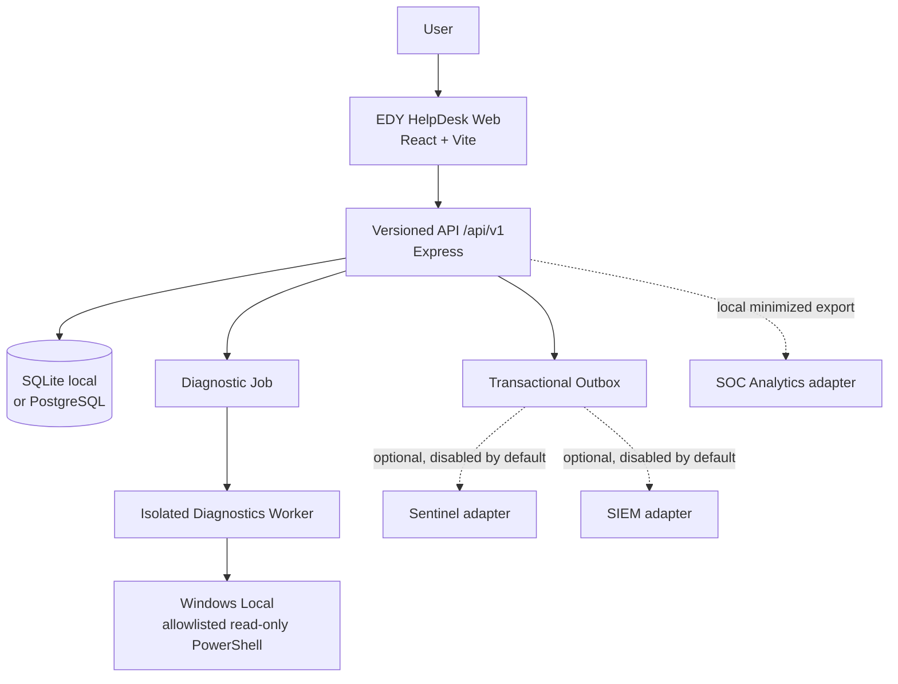

# EDY HelpDesk

Plataforma local-first de IT Help Desk / Service Desk criada para demonstrar práticas reais de suporte de TI, administração de ativos, operação de chamados e futura evolução para Blue Team/SOC.

## Current Status

**EDY HelpDesk v1.0.0 — release local auditada para portfólio.**

Disponível nesta fase:

- Autenticação local por sessão server-side, cookie seguro e Argon2id.
- RBAC deny-by-default para Admin, Technician e Viewer.
- Tickets com código transacional `HD-YYYY-NNNNNN`, máquina de estados e optimistic locking.
- Assignment/reassignment, comentários públicos, notas internas e timeline real.
- SLA 24x7 com pausa, retomada, encerramento, at-risk e breach preservado.
- Overview operacional, fila filtrável e workspace do técnico com dados reais.
- Operações de Users, Departments e Categories com archive, sem exclusão física.
- Auditoria append-only protegida também por triggers SQLite.
- Design system dark premium, command palette e interface responsiva.
- Localização oficial em Português do Brasil e English, com preferência persistente.
- Temas Operations e Dark baseados em design tokens, com preferência persistente.
- Dataset Portfolio Demo exclusivamente sintético.
- Inventário manual com código AST, Endpoint 360, atribuição a usuários e vínculo com tickets.
- Knowledge Base estruturada com código KB, drafts, publicação por Admin e referências em tickets.
- Versionamento concorrente de ativos e artigos, archive/restore e auditoria transacional.
- User Workspace com ativos atribuídos, tickets abertos e recentes.
- Catálogo de 9 diagnósticos locais read-only, Worker isolado, contenção nativa e JSON validado.
- Endpoint Health, histórico, eventos sanitizados e contexto do ativo dentro do ticket.
- Demo sem execução real; modo Operational exige banco separado e registro explícito do endpoint.

Entrega final e evidências: [Phase 7 Final Report](docs/PHASE-7-FINAL-REPORT.md).
Histórico: [Phase 3 Final Report](docs/PHASE-3-FINAL-REPORT.md).
Contratos: [Assets & Knowledge API](docs/api/phase3-assets-knowledge.md).
Phase 4: [relatório](docs/PHASE-4-FINAL-REPORT.md), [operação local](docs/phase4-operations.md), [API](docs/api/phase4-diagnostics.md).

Ainda não disponível:

- Remediação, execução remota, terminal e consultas livres.
- Conexão ativa com EDY Sentinel ou EDY SIEM: os projetos encontrados não oferecem contrato compatível; os adapters permanecem desabilitados e fail-closed.
- Deploy público.

## Screenshots

As imagens abaixo usam exclusivamente o modo Portfolio Demo e dados sintéticos.

| Central de Operações · pt-BR / Dark | Ticket Workspace · pt-BR / Operations |
|---|---|
|  |  |
| Endpoint 360 · pt-BR / Operations | Reports · en / Operations |
|  |  |

O conjunto público recomendado completo, limitado a oito imagens, está documentado no [Publication Gate Report](docs/PUBLICATION-GATE-REPORT.md).

## Arquitetura resumida



Web, API e Worker continuam processos separados. Nenhuma integração acessa o banco de outro produto, e nenhum payload remoto contém comando arbitrário, token de sessão ou saída diagnóstica bruta.

A arquitetura aprovada está em [ARCHITECTURE.md](ARCHITECTURE.md), o plano em [ROADMAP.md](ROADMAP.md) e o baseline em [SECURITY.md](SECURITY.md).

## Stack

- Node.js 22.12+ e npm 10+.
- React, TypeScript, Vite e React Router.
- TanStack Query e Zod.
- Express 5, Helmet, CORS e Pino.
- Prisma ORM 7.10, SQLite local e projeção PostgreSQL validada estaticamente.
- Vitest, Supertest e ESLint.

Prisma 7 é intencional: a versão 8 atual ainda não oferece SQLite.

## Estrutura

```text
apps/
  web/                  aplicação Service Desk React/Vite
  api/                  API REST, autenticação e domínio transacional
  diagnostics-worker/   processo-base sem PowerShell
packages/
  contracts/            contratos compartilhados
  domain/               máquina de estados e relógio de SLA
  config/               configuração validada
  test-utils/           utilidades de teste
prisma/                  schema, migration e seed
tests/                   E2E Playwright e matriz responsiva
docs/                    ADRs e documentação
scripts/                 automações seguras de qualidade
storage/                 dados locais ignorados pelo Git
```

## Requisitos

- Windows, Linux ou macOS.
- Node.js `>=22.12.0`.
- npm `>=10`.

O projeto liga API e Vite em loopback por padrão. Não exponha o ambiente em LAN sem uma revisão específica de TLS, autenticação e proxy.

## Instalação

```bash
npm ci
```

Copie `.env.example` para `.env` apenas no ambiente local. O arquivo contém somente defaults não secretos; `.env` é ignorado.

```bash
npm run db:generate
npm run db:migrate
npm run db:seed
```

## Configuração

| Variável | Exemplo local | Finalidade |
|---|---|---|
| `NODE_ENV` | `development` | modo de execução |
| `API_HOST` | `127.0.0.1` | bind seguro padrão |
| `API_PORT` | `8080` | porta da API |
| `WEB_ORIGIN` | `http://127.0.0.1:5173` | origem CORS allowlisted |
| `DATABASE_PROVIDER` | `sqlite` | provider explícito: `sqlite` ou `postgresql` |
| `DATABASE_URL` | `file:./storage/edy-helpdesk.db` | SQLite local |
| `LOG_LEVEL` | `info` | nível de logging |
| `PORTFOLIO_DEMO` | `true` | exige dados sintéticos e desabilita capacidades reais |
| `SESSION_IDLE_MINUTES` | `30` | expiração por inatividade da sessão |
| `SESSION_ABSOLUTE_HOURS` | `12` | duração absoluta máxima da sessão |
| `DEMO_SEED_PASSWORD` | definido localmente | senha Argon2id das contas sintéticas; não versionar |
| `INTEGRATION_*_ENABLED` | `false` | switches fail-closed; sempre recusados no Portfolio Demo |
| `INTEGRATION_*_URL` | vazio | origem privada/loopback validada, nunca hardcoded |
| `INTEGRATION_*_TOKEN` | vazio | segredo somente no ambiente local; nunca retornado pela API |
| `INTEGRATION_TIMEOUT_MS` | `3000` | timeout HTTP delimitado |
| `INTEGRATION_MAX_ATTEMPTS` | `5` | tentativas totais antes de dead-letter |
| `INTEGRATION_BACKOFF_BASE_MS` | `1000` | base do backoff exponencial limitado |

Configuração ausente ou inválida bloqueia o startup.

## Execução

Todos os processos:

```bash
npm run dev
```

Processos individuais:

```bash
npm run dev:api
npm run dev:web
npm run dev:worker
```

- Web: `http://127.0.0.1:5173`
- API health: `http://127.0.0.1:8080/api/v1/health`
- API readiness: `http://127.0.0.1:8080/api/v1/ready`

Contas sintéticas criadas pelo seed: `demo.admin`, `demo.technician` e
`demo.viewer`. Todas usam a senha fornecida localmente em `DEMO_SEED_PASSWORD`.
Para a build de produção local, use `npm run preview:web` e abra
`http://127.0.0.1:4173`.

`WEB_ORIGIN` é uma allowlist exata: use `http://127.0.0.1:5173` com
`npm run dev:web` e `http://127.0.0.1:4173` com `npm run preview:web`. Reinicie
a API após trocar a origem; o projeto não aceita origens alternativas por
conveniência.

## Languages

- Português do Brasil (`pt-BR`) — idioma inicial quando não existe preferência salva.
- English (`en`).

O idioma pode ser alterado no login, no menu da conta ou em **Configurações > Aparência**. A preferência é armazenada localmente no navegador, permanece após recarregar a aplicação e atualiza o atributo `lang` do documento. Datas, horários, números, tempos relativos, estados e mensagens conhecidas são apresentados conforme o locale; identificadores e evidências técnicas originais permanecem inalterados.

## Themes

- **Operations** — identidade principal aprovada, em graphite/charcoal com acento amber/copper.
- **Dark** — alternativa mais escura e discreta para IT Operations, sem estética cyber ou neon.

O tema pode ser alterado no menu da conta ou em **Configurações > Aparência**. A preferência persiste no navegador. Os dois temas compartilham os mesmos componentes e alteram somente design tokens por variáveis CSS.

## Banco

```bash
npm run db:validate
npm run db:generate
npm run db:migrate
npm run db:seed
```

O banco `.db` é local e ignorado. O seed não pode conter nome, e-mail, hostname, IP ou path real.

`db:migrate` aplica os arquivos SQL versionados de `prisma/migrations/` em transações,
registra o SHA-256 de cada versão em `_edy_migrations` e recusa alterações retroativas.
O comando `db:migrate:prisma` permanece como referência, mas não é o caminho autoritativo
da Phase 1 porque o engine de migration do Prisma apresentou falha opaca neste ambiente Windows.

SQLite permanece o provider padrão e integralmente suportado. A projeção PostgreSQL é gerada a partir do modelo canônico e pode ser verificada sem credenciais:

```bash
npm run db:validate
npm run db:validate:postgresql
npm run db:ddl:postgresql
```

O deploy PostgreSQL ao vivo requer `POSTGRES_TEST_DATABASE_URL` definido fora do repositório e um servidor local aprovado. Ele não foi validado neste ambiente; consulte [SQLite ↔ PostgreSQL parity](docs/database/SQLITE-POSTGRESQL-PARITY.md).

Backup e restore local controlado:

```bash
npm run backup:create
npm run restore:validate -- storage/backups/<backup> storage/restore-validation/<novo>.db
```

O restore valida checksum, integridade, chaves estrangeiras e contagens em um arquivo novo; não existe botão destrutivo de restore na interface.

## Qualidade

```bash
npm run lint
npm run typecheck
npm run test
npm run build
npm run audit:dependencies
npm run scan:secrets
npm run e2e
npm run check
```

Resultados finais devem ser medidos após instalação; este documento não fixa números de testes ou vulnerabilidades.

## Segurança

- Nunca versionar `.env`, bancos, logs, exports ou resultados diagnósticos.
- Nenhuma API aceita comando, script ou path PowerShell.
- O Diagnostics Worker continua separado; em modo operacional executa apenas o catálogo PowerShell read-only allowlisted, com `requiresElevation=false`, timeout, hash e limite de saída. O cliente nunca fornece script ou path.
- Sessões persistem somente o hash do token; cookies são `HttpOnly`, `SameSite=Strict`
  e `Secure` em produção.
- Mutação de tickets exige `version`; conflitos retornam HTTP 409 e nunca são
  sobrescritos automaticamente.
- Ativos e artigos também exigem `version` em suas mutações. Restore de artigo
  retorna a Draft, sem publicação implícita.
- RBAC é aplicado na API, nunca por dados enviados pelo frontend.
- Erros de produção são sanitizados.
- Request ID e correlation ID acompanham as respostas e logs.
- Portfolio Demo contém somente dados sintéticos.
- Integrações ficam desabilitadas por padrão; URLs precisam ser privadas/loopback, contratos são versionados e a entrega usa idempotência, retry, backoff e dead-letter.
- Exports neutralizam fórmulas CSV e a exportação analítica aplica minimização e referências pseudônimas.

## Funcionalidades e telas

O fluxo de suporte cobre abertura, triagem, atribuição, trabalho em andamento, notas internas, vínculo de ativo e artigo, resolução e SLA. A solução inclui:

- Overview, Operations Center, filas de Tickets, Assets e Security Cases;
- Ticket Workspace, User Workspace, Endpoint 360 e Knowledge Base;
- diagnósticos locais read-only, Health Summary, Network Diagnostics e Event Logs sanitizados;
- escalonamento 1:0..1 de Ticket para SecurityCase, evidências resumidas e workflow governado;
- dashboards com dados reais, Reports/History e CSV seguro;
- Integrations e Settings somente com capacidades reais e estados honestos;
- Command Palette com navegação por teclado e indicador discreto `DEMO DATA`.

Os princípios conceituais de UX, sem reprodução de branding proprietário, estão em [Design Research Phase 2](docs/design-research-phase2.md).

## Analytics e integrações

A exportação analítica local produz envelopes versionados para Tickets, SLAs, Assets, Diagnostics, Knowledge, SecurityCases e Calendar. Os arquivos usam escrita temporária + rename, checksum, record count, minimização e pseudonimização.

A descoberta real está em [Integration Discovery](docs/integrations/INTEGRATION-DISCOVERY.md). EDY Sentinel não foi encontrado; EDY SIEM foi classificado como incompatível com o contrato HelpDesk atual; EDY SOC Analytics aceita um contrato diferente. Por isso nenhuma conexão externa é anunciada como `Connected`. O adapter analítico local está `Export Ready`; mudanças nos demais produtos exigem aprovação separada.

## Portfolio Demo

`PORTFOLIO_DEMO=true` é o modo seguro de apresentação. Ele usa exclusivamente seed sintético, bloqueia diagnósticos reais e rejeita qualquer integração externa habilitada. Screenshots de portfólio devem ser produzidos somente nesse modo e nunca podem conter dados do host local.

## Limitações e Production Readiness Baseline

- Não há deploy público, TLS, reverse proxy ou secret manager configurado.
- PostgreSQL possui schema/DDL/paridade estática, mas o teste com servidor ao vivo está **NOT VALIDATED**.
- Sentinel e SIEM não possuem adapters ativos por incompatibilidade/indisponibilidade comprovada.
- Não há shell arbitrário, PowerShell remoto, WinRM, SSH, RDP, remediação, escrita em AD ou firewall.
- Leitor de tela externo e operação sob proxy TLS real permanecem pendentes de validação.
- A distribuição está licenciada sob a MIT License; qualquer publicação continua dependendo de autorização explícita do proprietário.

Requisitos antes de uma exposição real estão em [Production Readiness Baseline](docs/operations/PRODUCTION-READINESS-BASELINE.md), com retenção, observabilidade e backup nos demais runbooks de `docs/operations/`.

## Documentação da API e segurança de publicação

- [OpenAPI v1](docs/api/openapi-v1.yaml) — superfície interna relevante, sem exemplos secretos;
- [Phase 7 Integrations API](docs/api/phase7-integrations.md);
- [Security Review](docs/security/PHASE-7-SECURITY-REVIEW.md);
- [Publication Checklist](docs/PUBLICATION-CHECKLIST.md);
- [Release Notes 1.0.0](docs/RELEASE-NOTES-1.0.0.md);
- [Final Release Audit](docs/FINAL-RELEASE-AUDIT-REPORT.md);
- [Publication Gate Report](docs/PUBLICATION-GATE-REPORT.md);
- [Changelog](CHANGELOG.md).

Antes de qualquer GitHub, execute todos os gates e revise o checklist. Este workspace não inicializa repositório, não cria remote, não publica e não faz push automaticamente.

## Roadmap

As fases 1–7 estão documentadas nos respectivos relatórios. A versão `1.0.0` está licenciada sob MIT e foi aprovada tecnicamente para uso local; publicação pública continua condicionada à autorização explícita do proprietário. Funcionalidades futuras só entram após atualização de [ROADMAP.md](ROADMAP.md).

## License

Licenciado sob a [MIT License](LICENSE). Copyright (c) 2026 Edmilson Gomes.
